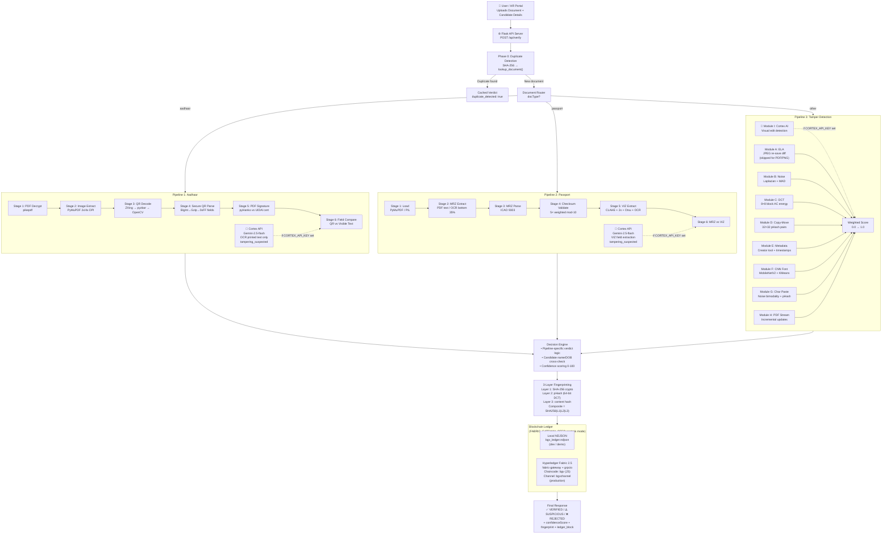
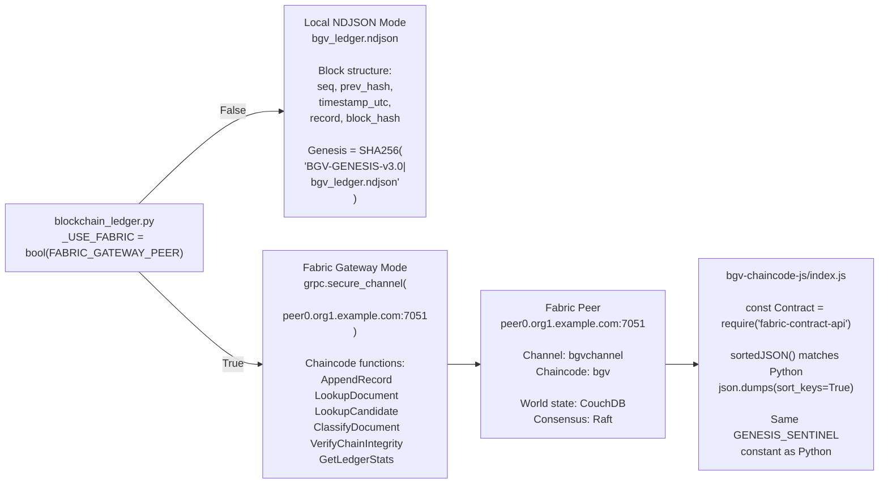
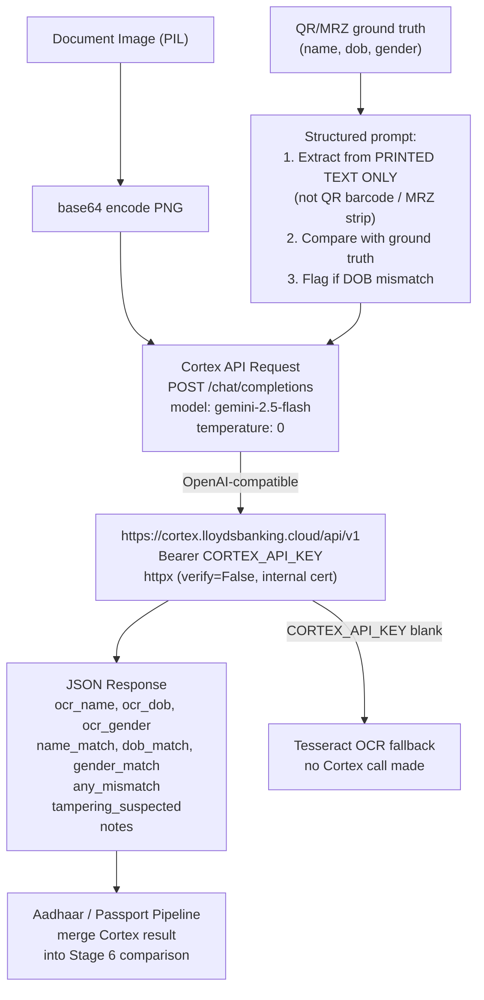
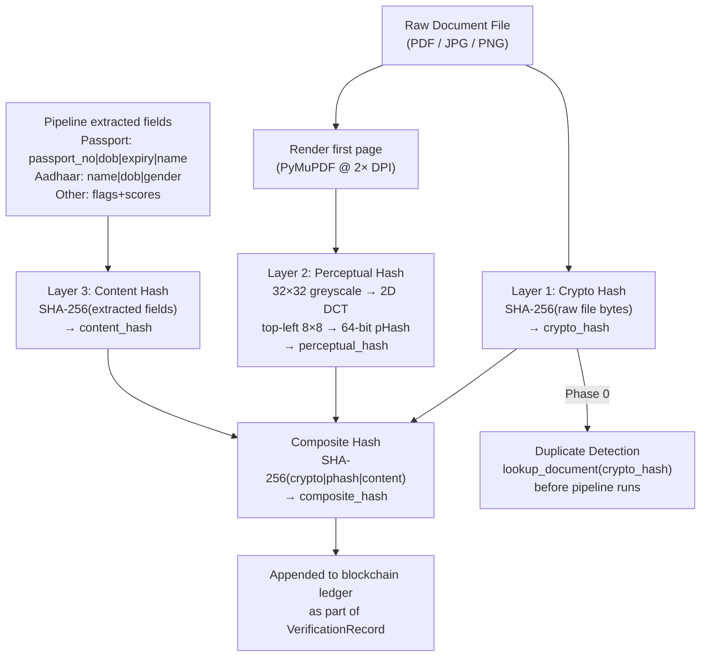

# BGV v3.1 Architecture Diagrams (Mermaid Source)
# Render at: https://mermaid.live or any Mermaid-compatible viewer

---

## 1. Full System Architecture (with Fabric + Cortex)

---

## 2. Blockchain Dual-Mode Detail

---

## 3. Cortex OCR Flow

---

## 4. Three-Layer Fingerprint

