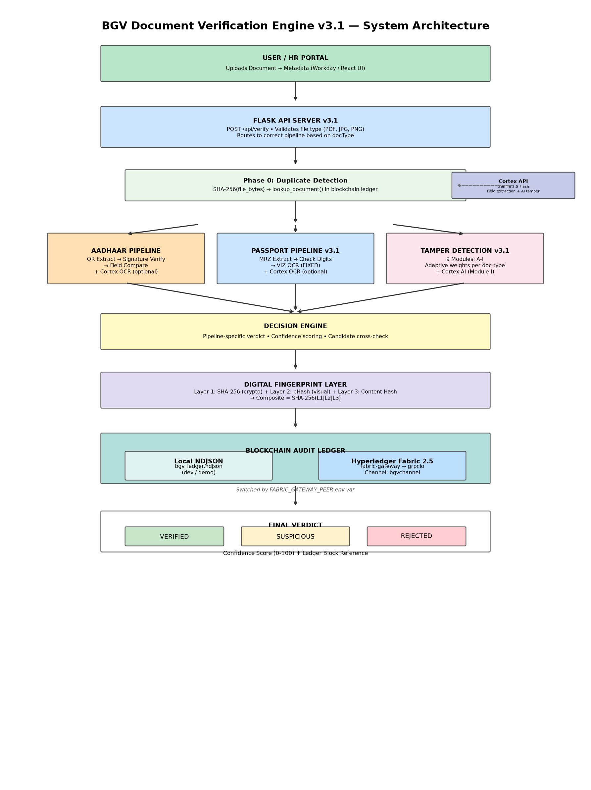
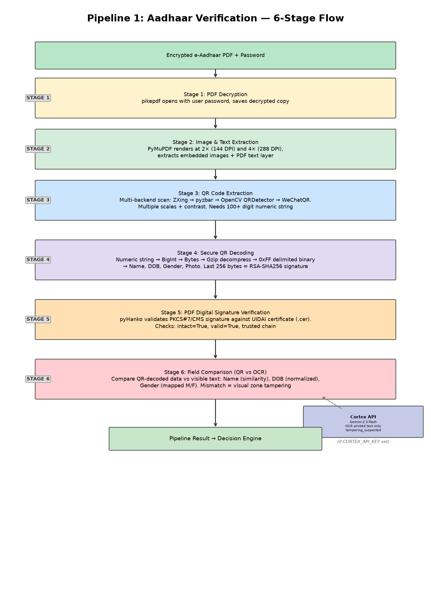
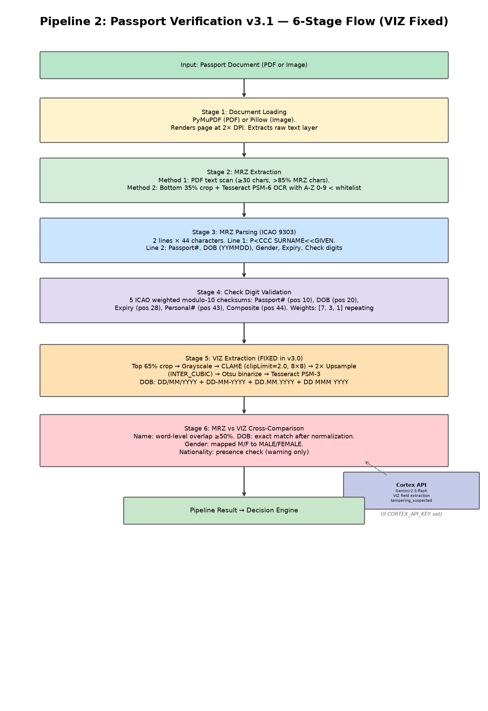
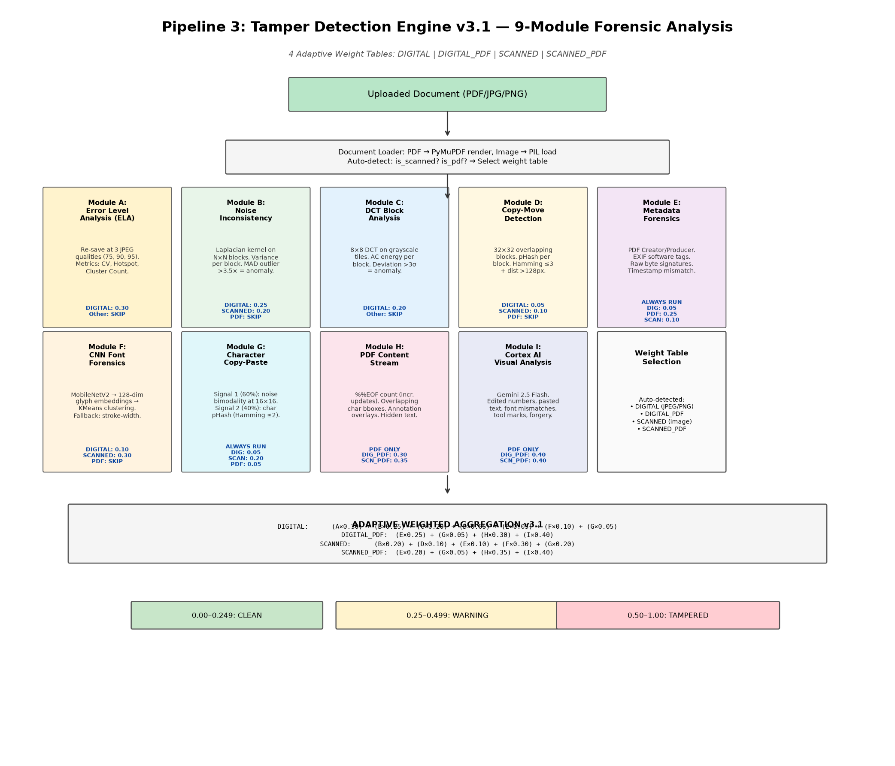
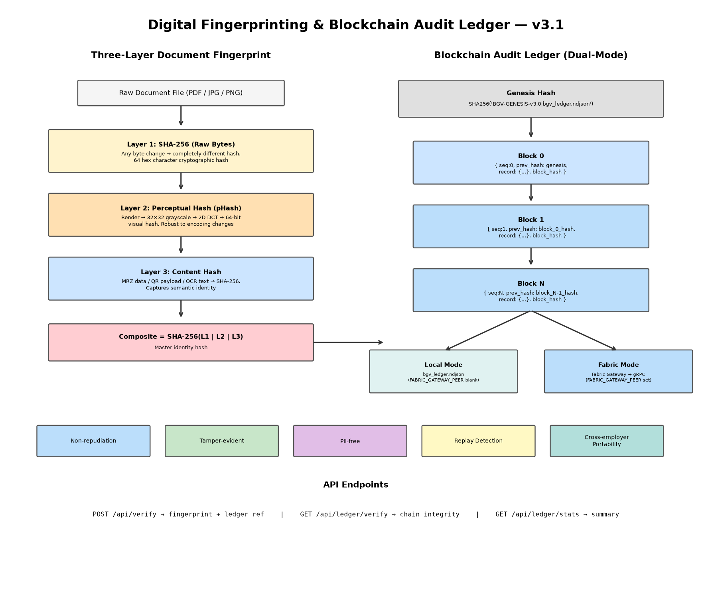
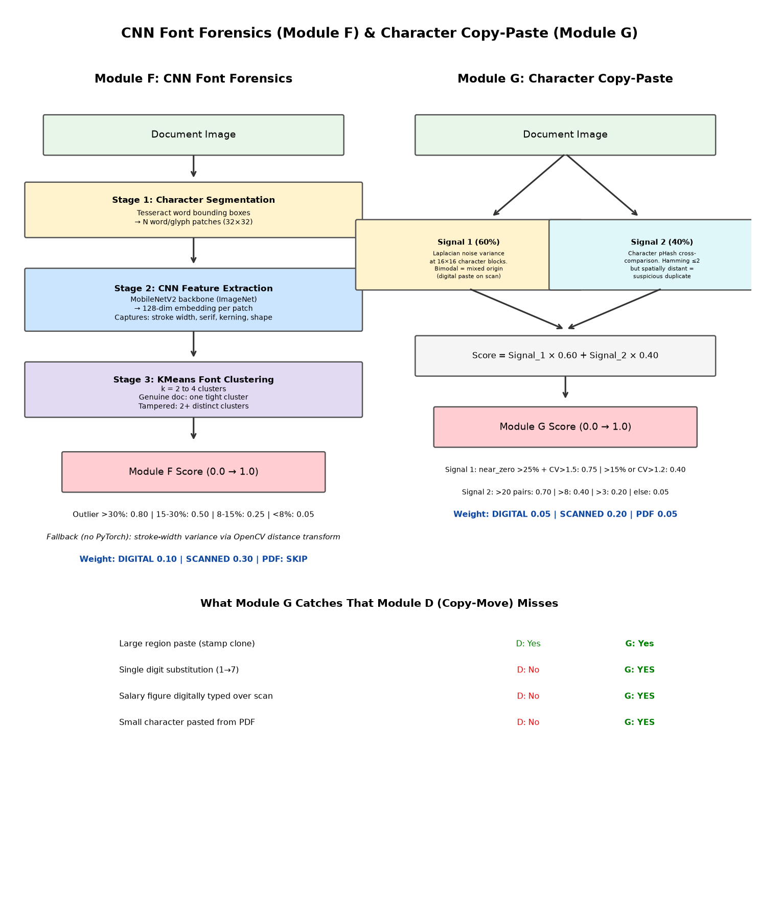

# 🔒 BGV Document Verification Engine — Complete Technical Reference

> **Version:** 3.1 &nbsp;|&nbsp; **Engine:** `tamper-detection-v3.0` &nbsp;|&nbsp; **Last Updated:** July 2026

---

## 📋 Table of Contents

1. [System Overview](#1-system-overview)
2. [High-Level Architecture](#2-high-level-architecture)
3. [Technology Stack](#3-technology-stack)
4. [Pipeline 1: Aadhaar Verification](#4-pipeline-1-aadhaar-verification)
5. [Pipeline 2: Passport Verification](#5-pipeline-2-passport-verification)
6. [Pipeline 3: Tamper Detection Engine](#6-pipeline-3-tamper-detection-engine)
7. [Decision Engine & Cross-Verification](#7-decision-engine--cross-verification)
8. [Verdict System](#8-verdict-system)
9. [Confidence Scoring Model](#9-confidence-scoring-model)
10. [Glossary of Terms](#10-glossary-of-terms)
11. [Digital Fingerprinting & Blockchain Layer](#11-digital-fingerprinting--blockchain-layer)
12. [CNN Font Forensics Module](#12-cnn-font-forensics-module)
13. [Character-Level Copy-Paste Detection](#13-character-level-copy-paste-detection)
14. [Cortex LLM OCR Integration](#14-cortex-llm-ocr-integration)

---

## 1. System Overview

The **BGV (Background Verification) Document Verification Engine v3.0** is an automated system designed to verify the authenticity of identity documents submitted during employee background checks. It processes uploaded documents through specialized verification pipelines and produces a verdict: **VERIFIED**, **SUSPICIOUS**, or **REJECTED**.

### What It Does
- **Aadhaar Cards:** Decrypts password-protected e-Aadhaar PDFs, extracts and verifies the embedded QR code’s cryptographic signature against UIDAI’s official certificate, and cross-checks QR data with the visible text on the document.
- **Passports:** Extracts and parses the Machine Readable Zone (MRZ), validates all ICAO 9303 check digits, and compares MRZ data with the Visual Inspection Zone (VIZ) using a preprocessed OCR pipeline (CLAHE → 2× upsample → Otsu binarization).
- **Other Documents (Degree Certificates, Payslips, Experience Letters, etc.):** Runs 7-module forensic analysis including ELA, Noise Analysis, DCT, Copy-Move, Metadata, **CNN Font Forensics**, and **Character Copy-Paste Detection**.
- **Cross-Verification:** Optionally compares the candidate’s expected name and date of birth against the data found on the document.
- **Digital Fingerprinting (v3.0 NEW):** Every processed document receives a three-layer fingerprint (SHA-256 cryptographic hash + perceptual hash + content hash) anchored to a blockchain-style hash-chained immutable ledger.

---

## 2. High-Level Architecture

```
┌─────────────────────────────────────────────────────────────────┐
│                      USER / HR PORTAL                           │
│          Uploads Document + Metadata (Workday / React UI)       │
└──────────────────────────┬──────────────────────────────────────┘
                           │
                           ▼
┌─────────────────────────────────────────────────────────────────┐
│                    FLASK API SERVER v3.0                        │
│               POST /api/verify                                  │
│   • Validates file type (PDF, JPG, PNG)                         │
│   • Saves to /uploads/ temporarily                              │
│   • Routes to correct pipeline based on docType                 │
└──────────────┼──────────────┼──────────────┼────────────────────┘
               │              │              │
    ┌──────────▼──┐   ┌─────▼─────┐  ┌────▼──────────────┐
    │  AADHAAR    │   │  PASSPORT │  │ TAMPER DETECTION  │
    │  PIPELINE   │   │  PIPELINE │  │ ENGINE v3.0       │
    │  (aadhaar)  │   │ (passport)│  │ Modules A–H       │
    │  + Cortex   │   │ + Cortex  │  │ + Cortex (Mod I)  │
    └──────────┼──┘   └─────┼─────┘  └────────┼──────────┘
               │            │                 │
               └────────────┴─────────────────┘
                              │
                              ▼
               ┌──────────────────────────────┐
               │      DECISION ENGINE         │
               │  • Pipeline-specific verdict │
               │  • Confidence scoring        │
               │  • Candidate cross-check     │
               └──────────────┬───────────────┘
                              │
                              ▼
               ┌──────────────────────────────┐
               │    3-LAYER FINGERPRINTING    │
               │  crypto + phash + content    │
               └──────────────┬───────────────┘
                              │
                              ▼
               ┌──────────────────────────────────────┐
               │       BLOCKCHAIN LEDGER              │
               │  ┌──────────────────────────────┐    │
               │  │  Local NDJSON  │  Hyperledger │    │
               │  │  (dev/demo)    │  Fabric 2.5  │    │
               │  │                │  (production)│    │
               │  └──────────────────────────────┘    │
               │   Switched by FABRIC_GATEWAY_PEER     │
               └──────────────┬───────────────────────┘
                              │
                              ▼
               ┌──────────────────────────────┐
               │       FINAL VERDICT          │
               │  ✅ VERIFIED                 │
               │  ⚠️  SUSPICIOUS              │
               │  ❌ REJECTED                 │
               │  + Confidence Score (0-100)  │
               └──────────────────────────────┘
```

### Architecture Diagram



---

## 3. Technology Stack

### Backend
| Component | Technology | Purpose |
|---|---|---|
| **Web Server** | Flask (Python) | REST API, file handling, static serving |
| **PDF Processing** | pikepdf, PyMuPDF (fitz) | PDF decryption, rendering, text extraction |
| **QR Decoding** | ZXing C++ (zxingcpp), pyzbar, OpenCV | Multi-backend QR code reading |
| **Aadhaar QR Parsing** | pyaadhaar, manual bigint→gzip→binary decoder | Decode Secure QR v2 payloads |
| **Cryptographic Verification** | pyHanko, cryptography | PKCS#7/CMS PDF signature validation |
| **MRZ Parsing** | Custom ICAO 9303 parser | Machine Readable Zone extraction & checksums |
| **OCR Engine** | Tesseract (pytesseract) | OCR for MRZ (PSM 6) and VIZ (PSM 3) |
| **Cortex LLM OCR** | Cortex API + Gemini-2.5-flash | Vision-based field extraction for Aadhaar/Passport |
| **VIZ Preprocessing** | OpenCV (CLAHE, Otsu), PIL | Contrast norm + upsample before VIZ OCR |
| **Image Processing** | Pillow (PIL), NumPy, OpenCV | Image manipulation, ELA, noise analysis |
| **PDF Metadata** | PyPDF2 | Metadata extraction and forensic analysis |
| **Digital Fingerprinting** | hashlib (SHA-256), scipy/PIL (pHash) | Three-layer document fingerprint |
| **Blockchain Ledger (local)** | hashlib, JSON (NDJSON) | Hash-chained immutable audit ledger (dev/demo) |
| **Blockchain Ledger (prod)** | fabric-gateway, grpcio | Hyperledger Fabric 2.5 gRPC gateway |
| **CNN Font Forensics** | PyTorch + MobileNetV2, scikit-learn KMeans | Glyph embedding + font cluster analysis |
| **Character Copy-Paste** | OpenCV (Laplacian), pytesseract (bbox) | Noise bimodality + character pHash collisions |

### Frontend
| Component | Technology | Purpose |
|---|---|---|
| **UI** | HTML5, CSS3, JavaScript | Single-page upload and results interface |
| **Styling** | Vanilla CSS (glassmorphism) | Modern UI with dark theme |

### Key Python Libraries
| Library | Version Context | Used In |
|---|---|---|
| `pikepdf` | PDF decryption | Aadhaar Pipeline |
| `PyMuPDF` (fitz) | High-DPI page rendering | Aadhaar, Passport, Tamper |
| `zxingcpp` | Primary QR scanner | Aadhaar Pipeline |
| `pyzbar` | Fallback QR scanner | Aadhaar Pipeline |
| `pyaadhaar` | Aadhaar Secure QR library | Aadhaar Pipeline |
| `pyHanko` | PDF digital signature verification | Aadhaar Pipeline |
| `cryptography` | X.509 certificate handling | Aadhaar Pipeline |
| `pytesseract` | OCR text extraction | Aadhaar, Passport |
| `openai` | OpenAI-compatible client for Cortex API | cortex_ocr.py |
| `httpx` | Async HTTP client (Cortex API, SSL skip) | cortex_ocr.py |
| `OpenCV` (cv2) | Image forensics, QR detection | All Pipelines |
| `Pillow` (PIL) | Image loading and manipulation | All Pipelines |
| `NumPy` | Numerical array operations | Tamper Pipeline |
| `PyPDF2` | PDF metadata extraction | Tamper Pipeline |
| `scipy` | Perceptual hash DCT computation | fingerprint.py |
| `fabric-gateway` | Hyperledger Fabric Python Gateway SDK | blockchain_ledger.py |
| `grpcio` | gRPC transport for Fabric peer connection | blockchain_ledger.py |

---

## 4. Pipeline 1: Aadhaar Verification

### Sub-Architecture



### Flow
```
Encrypted PDF + Password
        │
        ▼
┌─────────────────────┐
│ STAGE 1: Decrypt PDF │ ──→ pikepdf opens with password, saves decrypted copy
└─────────┬───────────┘
          ▼
┌────────────────────────────┐
│ STAGE 2: Extract Images    │ ──→ PyMuPDF renders at 2x (144 DPI) and 4x (288 DPI)
│          & Text            │     + extracts embedded image objects (photo, etc.)
└─────────┬──────────────────┘     + extracts raw PDF text layer
          ▼
┌─────────────────────────────┐
│ STAGE 3: Extract QR Code    │ ──→ Scans page renders with ZXing → pyzbar → OpenCV
│          (Numeric String)   │     Tries multiple scales and contrast enhancements
└─────────┬───────────────────┘
          ▼
┌──────────────────────────────┐
│ STAGE 4: Decode Secure QR    │ ──→ Numeric string → BigInt → Bytes → Gzip decompress
│          (Demographics)      │     → Split by 0xFF delimiter → Extract name/DOB/gender
└─────────┬────────────────────┘
          ▼
┌───────────────────────────────────┐
│ STAGE 5: PDF Digital Signature    │ ──→ pyHanko validates PKCS#7/CMS signature
│          Verification             │     against UIDAI certificate (.cer file)
└─────────┬─────────────────────────┘
          ▼
┌────────────────────────────────┐
│ STAGE 6: Field Comparison      │ ──→ Compare QR data vs OCR/PDF visible text
│          (QR vs Visible Text)  │     for Name, DOB, Gender
└────────────────────────────────┘
```

---

### Stage-by-Stage Validation Details

#### 📌 Stage 1: PDF Decryption
| Attribute | Detail |
|---|---|
| **What it checks** | Whether the provided password can successfully decrypt the PDF |
| **Library** | `pikepdf` |
| **How it works** | Opens the encrypted PDF using the user-provided password. If successful, saves a decrypted copy for further processing |
| **Pass condition** | Password accepted, PDF decrypted without errors |
| **Fail condition** | Wrong password (PasswordError) or corrupt PDF |
| **Why it matters** | e-Aadhaar PDFs are always password-protected (typically last 4 digits of Aadhaar + year of birth). If the password is wrong, the document cannot be processed at all |

#### 📌 Stage 2: Image & Text Extraction
| Attribute | Detail |
|---|---|
| **What it checks** | Whether images and text can be extracted from the PDF |
| **Library** | `PyMuPDF` (fitz), fallback to `pikepdf` XObject iteration |
| **How it works** | Renders each PDF page at **2x** (144 DPI) and **4x** (288 DPI) resolution. Also extracts embedded image objects (passport photo) and the PDF text layer directly |
| **Pass condition** | At least one image and text content extracted |
| **Why it matters** | The 4x render is critical because the Aadhaar QR code is a vector object in the PDF — it only appears when the page is fully composed/rendered, not as a separate image object. Higher DPI = better QR detection accuracy |

#### 📌 Stage 3: QR Code Extraction
| Attribute | Detail |
|---|---|
| **What it checks** | Whether a QR code exists in the document and can be read |
| **Libraries** | `zxingcpp` (primary), `pyzbar` (fallback), `OpenCV QRCodeDetector` (fallback), `WeChatQRCode` (last resort) |
| **How it works** | Scans the page renders in order of quality (4x first, then 2x, then embedded images sorted by size). Tries multiple backends and image preprocessing (grayscale, contrast enhancement, multi-scale). Aadhaar Secure QR always contains **only digits** |
| **Pass condition** | A numeric string of 100+ characters is detected |
| **Fail condition** | No QR code found after all backends and scales are tried |
| **Why it matters** | The QR code is the **cryptographic anchor** of the entire verification. Without it, no signature verification or data extraction is possible. This is the most critical extraction step |

#### 📌 Stage 4: Secure QR Decoding
| Attribute | Detail |
|---|---|
| **What it checks** | Whether the QR numeric string can be decoded into demographic data |
| **Libraries** | `pyaadhaar` (primary), manual decoder (fallback), XML parser (for pre-2019 Aadhaar) |
| **How it works** | The Aadhaar Secure QR v2 format works as follows: |
|  | 1. The QR contains a **large numeric string** (hundreds of digits) |
|  | 2. Convert to a Python big integer → convert to raw bytes (big-endian) |
|  | 3. **Gzip decompress** the bytes |
|  | 4. The decompressed data is a **binary structure** with fields separated by `0xFF` bytes |
|  | 5. Fields include: email_mobile_flag, reference_id, **name**, **DOB**, **gender**, address fields, pincode, state, country, and a JPEG2000 photo |
|  | 6. The **last 256 bytes** of the original compressed data is the **RSA-SHA256 signature** |
| **Pass condition** | Name, DOB, and Gender successfully extracted |
| **Why it matters** | This decoding gives us the **cryptographically sealed** data that UIDAI embedded in the QR. If someone edits the visible text on the document, the QR data will not match — this is the core tamper-detection mechanism for Aadhaar |

#### 📌 Stage 5: PDF Digital Signature Verification
| Attribute | Detail |
|---|---|
| **What it checks** | Whether the PDF's embedded PKCS#7/CMS digital signature is valid and was signed by UIDAI |
| **Library** | `pyHanko`, `cryptography` |
| **How it works** | Loads the UIDAI production certificate (`uidai_auth_sign_Prod_2026.cer`), then uses pyHanko's `validate_pdf_signature()` to check: (a) the signature covers the entire document content, (b) the document hasn't been modified after signing, (c) the signer's certificate chains back to the trusted UIDAI root |
| **Pass condition** | `status.intact == True AND status.valid == True` |
| **Fail scenarios** | Signature present but invalid (document modified), untrusted certificate, no signature found |
| **Why it matters** | A valid digital signature is the **strongest possible proof** that the document was generated by UIDAI and has not been altered. Even a single byte change to the PDF invalidates the signature. This is equivalent to what Adobe Acrobat shows as "Signed and all signatures are valid" |

#### 📌 Stage 6: Field Comparison (QR vs OCR)
| Attribute | Detail |
|---|---|
| **What it checks** | Whether the data embedded in the QR code matches the visible text printed on the document |
| **Fields compared** | **Name** (substring + similarity scoring), **DOB** (normalized date comparison), **Gender** (mapped M/F/T → MALE/FEMALE/TRANSGENDER) |
| **How it works** | Extracts text from the PDF text layer (or via Tesseract OCR if no text layer). Uses regex patterns to find name, DOB, and gender in the visible text. Then compares each field against the QR-decoded values |
| **Pass condition** | All compared fields match |
| **Why it matters** | If someone edits the **visible text** on an Aadhaar (e.g., changes the name), the QR code will still contain the original data. A mismatch between QR and visible text is a strong indicator of **visual zone tampering** |

---

## 5. Pipeline 2: Passport Verification

### Sub-Architecture



### Flow
```
PDF or Image File
        │
        ▼
┌─────────────────────────┐
│ STAGE 1: Load Document   │ ──→ PyMuPDF (PDF) or PIL (Image)
└─────────┬───────────────┘
          ▼
┌────────────────────────────┐
│ STAGE 2: Extract MRZ       │ ──→ PDF text extraction or bottom-35% crop + OCR
└─────────┬──────────────────┘
          ▼
┌────────────────────────────┐
│ STAGE 3: Parse MRZ         │ ──→ ICAO 9303 standard parsing
│ (2 lines × 44 characters)  │     → Name, Passport#, Nationality, DOB, Gender, Expiry
└─────────┬──────────────────┘
          ▼
┌──────────────────────────────────┐
│ STAGE 4: Validate Check Digits   │ ──→ 5 weighted modulo-10 checksums
└─────────┬────────────────────────┘
          ▼
┌──────────────────────────────┐
│ STAGE 5: Extract VIZ          │ ──→ Top-65% crop + text extraction
│ (Visual Inspection Zone)     │     → Name, DOB, Gender, Nationality
└─────────┬────────────────────┘
          ▼
┌──────────────────────────────────┐
│ STAGE 6: Compare MRZ vs VIZ     │ ──→ Cross-check all extracted fields
└──────────────────────────────────┘
```

---

### Stage-by-Stage Validation Details

#### 📌 Stage 1: Document Loading
| Attribute | Detail |
|---|---|
| **What it checks** | Whether the uploaded file can be loaded as an image for processing |
| **Library** | `PyMuPDF` (fitz) for PDFs, `Pillow` (PIL) for images |
| **How it works** | For PDFs: opens with PyMuPDF, extracts text from all pages, renders page 1 at 2x DPI. For images: opens directly with PIL |
| **Pass condition** | An image of the document is available for processing |
| **Output** | `image` (PIL Image), `text` (raw extracted text) |

#### 📌 Stage 2: MRZ Extraction
| Attribute | Detail |
|---|---|
| **What it checks** | Whether a Machine Readable Zone (MRZ) exists in the document |
| **How it works** | **Method 1:** Searches the raw PDF text for lines that are ≥30 characters long and contain >85% MRZ characters (A-Z, 0-9, `<`). **Method 2:** Crops the bottom 35% of the image (where MRZ is physically located on a passport) and runs OCR with a restricted character whitelist |
| **Library** | `pytesseract` with PSM-6 mode and `ABCDEFGHIJKLMNOPQRSTUVWXYZ0123456789<` whitelist |
| **Pass condition** | Two valid MRZ lines detected |
| **Why it matters** | The MRZ is the **machine-readable truth** on a passport. If no MRZ is found, the document cannot be verified as a passport |

#### 📌 Stage 3: MRZ Parsing (ICAO 9303)
| Attribute | Detail |
|---|---|
| **What it checks** | Whether the MRZ conforms to the ICAO 9303 standard for Type-3 (passport) travel documents |
| **Standard** | **ICAO Document 9303** — international standard for Machine Readable Travel Documents (MRTDs) |
| **MRZ Structure** | Two lines of exactly 44 characters each: |
| **Line 1** | `P<CCCSURNAME<<GIVENNAMES<<<<<<<<<<<<<<<<<<` |
|  | `P` = Document type, `CCC` = Issuing country (3-letter ISO), `<<` = separator between surname and given names |
| **Line 2** | `PPPPPPPPPCDDDDDDDCGEEEEEECOOOOOOOOOOOOOOC` |
|  | `P×9` = Passport number, `C` = Check digit, `D×6` = DOB (YYMMDD), `G` = Gender (M/F/<), `E×6` = Expiry (YYMMDD), `O×14` = Optional data |
| **Parsed fields** | `doc_type`, `issuing_country`, `surname`, `given_names`, `full_name`, `passport_number`, `nationality`, `dob` (YYMMDD), `gender`, `expiry` (YYMMDD) |
| **Pass condition** | Both lines are 44 characters, document type starts with `P` |

#### 📌 Stage 4: Check Digit Validation
| Attribute | Detail |
|---|---|
| **What it checks** | Mathematical integrity of 5 separate check digits embedded in the MRZ |
| **Algorithm** | **ICAO Weighted Modulo-10**: Each character is assigned a value (0-9 for digits, 10-35 for A-Z, 0 for `<`). Characters are multiplied by repeating weights `[7, 3, 1]`, summed, and the result modulo 10 gives the check digit |

| Check Digit | Data Covered | Position in Line 2 | What It Validates |
|---|---|---|---|
| **Passport Number** | Characters 1-9 | Position 10 | Verifies the passport number hasn't been altered |
| **Date of Birth** | Characters 14-19 (YYMMDD) | Position 20 | Verifies the DOB hasn't been changed |
| **Expiry Date** | Characters 22-27 (YYMMDD) | Position 28 | Verifies the expiry date is authentic |
| **Personal Number** | Characters 29-42 (optional data) | Position 43 | Verifies optional/personal number data (if present) |
| **Composite** | Passport# + check + DOB + check + Expiry + check + Optional + opt-check | Position 44 | **Master check** that validates ALL the above fields together. A single digit that ensures the entire Line 2 is intact |

| **Pass condition** | All computed check digits match the actual digits in the MRZ |
|---|---|
| **Why it matters** | Even changing a **single character** in the passport number, DOB, or expiry will cause the corresponding check digit (and the composite) to fail. This makes MRZ manipulation extremely difficult without knowledge of the algorithm |

#### 📌 Stage 5: Visual Inspection Zone (VIZ) Extraction
| Attribute | Detail |
|---|---|
| **What it checks** | Extracts human-readable text from the top portion of the passport page |
| **How it works** | Crops the **top 65%** of the document image (the VIZ area above the MRZ) and runs OCR or text extraction. Searches for name (uppercase-heavy lines), DOB (DD/MM/YYYY patterns), gender (MALE/FEMALE keywords), and nationality |
| **Pass condition** | At least name or DOB extracted |
| **Why it matters** | The VIZ contains the same information as the MRZ but in human-readable format. By comparing both zones, we can detect if someone edited the visible text while leaving the MRZ intact (or vice versa) |

#### 📌 Stage 6: MRZ vs VIZ Cross-Comparison
| Attribute | Detail |
|---|---|
| **What it checks** | Whether the machine-readable data matches the human-readable data |
| **Fields compared** | |

| Field | MRZ Source | VIZ Source | Match Logic |
|---|---|---|---|
| **Name** | `full_name` from MRZ Line 1 | Extracted uppercase text | Word-level overlap ≥50% of minimum word count. Falls back to searching raw text for individual name words |
| **Date of Birth** | `dob_formatted` (DD/MM/YYYY) | Regex-extracted date | Exact string match after format normalization |
| **Gender** | MRZ character (M/F/<) mapped to MALE/FEMALE | Regex-extracted keyword | Exact match of mapped values |
| **Nationality** | 3-letter code from MRZ | Searched in raw VIZ text | Presence check (warning only, does not fail — because "IND" vs "INDIAN" differ in representation) |

| **Pass condition** | All compared fields match |
|---|---|
| **Why it matters** | A fraudster who changes the printed name on a passport but doesn't know how to regenerate the MRZ (including correct check digits) will be caught here. This is the **dual-zone integrity** check |

---

## 6. Pipeline 3: Tamper Detection Engine

### Sub-Architecture



### Applies To
Degree certificates, payslips, experience letters, offer letters, and **any uploaded document** that is not an Aadhaar or Passport.

### Module Summary (v3.1 — 9 Modules)

| Module | Name | What It Detects | Applicable To |
|---|---|---|---|
| **A** | Error Level Analysis (ELA) | JPEG compression inconsistencies from pasted content | Digital images (JPEG) ONLY |
| **B** | Noise Inconsistency | Mixed sensor noise from different image sources | Digital images ONLY |
| **C** | DCT Block Analysis | JPEG quantization mismatches from spliced blocks | Digital images (JPEG) ONLY |
| **D** | Copy-Move Detection | Cloned/duplicated regions within the same image | Digital images ONLY |
| **E** | Metadata Forensics | Editing tool traces, timestamp mismatches | ALL documents |
| **F** | CNN Font Forensics | Inconsistent font/stroke patterns from pasted text | Digital images + Scanned images ONLY |
| **G** | Character Copy-Paste | Single-character digital substitutions (noise bimodality + pHash) | ALL documents |
| **H** | PDF Content Stream Forensics | Layer overlays, incremental edits, annotations | PDFs ONLY |
| **I** | Cortex AI Visual Analysis | Targeted edits detected by Gemini vision model | PDFs ONLY (needs CORTEX_API_KEY) |

### Module Skip Matrix

| Module | Digital Image | Scanned Image | Born-Digital PDF | Scanned PDF | Why Skipped |
|---|---|---|---|---|---|
| A: ELA | ✅ RUN | ❌ SKIP | ❌ SKIP | ❌ SKIP | Scanner JPEG artifacts / PDF lossless render → false positives |
| B: Noise | ✅ RUN | ✅ RUN (raised threshold) | ❌ SKIP | ❌ SKIP | PDF high-contrast text inflates noise CV on clean docs |
| C: DCT | ✅ RUN | ❌ SKIP | ❌ SKIP | ❌ SKIP | Scanner artifacts / PDF rendered from vectors, no JPEG blocks |
| D: Copy-Move | ✅ RUN | ✅ RUN | ❌ SKIP | ❌ SKIP | PDF structural repeats (borders, tables) → hundreds of false pairs |
| E: Metadata | ✅ RUN | ✅ RUN | ✅ RUN | ✅ RUN | Always applicable — editing tool signatures |
| F: Font CNN | ✅ RUN | ✅ RUN | ❌ SKIP | ❌ SKIP | PDFs legitimately use multiple font families/sizes |
| G: Char Paste | ✅ RUN | ✅ RUN | ✅ RUN | ✅ RUN | Always applicable — noise bimodality + character pHash |
| H: PDF Layers | ❌ N/A | ❌ N/A | ✅ RUN | ✅ RUN | Only meaningful for PDF object model analysis |
| I: Cortex AI | ❌ N/A | ❌ N/A | ✅ RUN | ✅ RUN | AI visual analysis for specific targeted PDF edits |

### Four Adaptive Weight Tables

The engine selects one of four weight configurations based on document type:

**Mode 1: DIGITAL (JPEG/PNG digital images)**
```
ELA×0.30 + Noise×0.25 + DCT×0.20 + CopyMove×0.05 + Meta×0.05 + FontCNN×0.10 + CharPaste×0.05 = 1.00
```

**Mode 2: DIGITAL_PDF (Born-digital PDFs)**
```
Meta×0.25 + CharPaste×0.05 + PDFLayers×0.30 + CortexAI×0.40 = 1.00
(ELA, Noise, DCT, CopyMove, FontCNN all skipped)
```

**Mode 3: SCANNED (Scanned/photographed raster images)**
```
Noise×0.20 + CopyMove×0.10 + Meta×0.10 + FontCNN×0.30 + CharPaste×0.20 + CortexAI×0.10 = 1.00
(ELA and DCT skipped — FontCNN promoted to primary detector)
```

**Mode 4: SCANNED_PDF (Physical document scanned to PDF)**
```
Meta×0.20 + CharPaste×0.05 + PDFLayers×0.35 + CortexAI×0.40 = 1.00
(All pixel-analysis modules skipped — only PDF structure + AI)
```

### Document Type Auto-Detection

The engine auto-detects whether a PDF is scanned or born-digital:
```python
def _is_scanned_pdf(raw_text, image):
    # If extractable text is very sparse relative to image size → scan
    text_density = len(raw_text.strip()) / (image.width * image.height)
    return text_density < 0.0001  # or text < 50 chars
```

### Flow
```
Uploaded Document (PDF/JPG/PNG)
        │
        ▼
┌────────────────────────────┐
│ Document Loader             │ ──→ PDF→PyMuPDF render or Image→PIL load
│ Auto-detect: scanned?       │     (text_density < 0.0001 → scanned PDF)
└─────────┬──────────────────┘
          │
          ├──→ Module A: ELA                    ──→ Score A (or 0.0 if skipped)
          ├──→ Module B: Noise Inconsistency    ──→ Score B (or 0.0 if skipped)
          ├──→ Module C: DCT Block Analysis     ──→ Score C (or 0.0 if skipped)
          ├──→ Module D: Copy-Move Detection    ──→ Score D (or 0.0 if skipped)
          ├──→ Module E: Metadata Forensics     ──→ Score E (always runs)
          ├──→ Module F: CNN Font Forensics     ──→ Score F (or 0.0 if skipped)
          ├──→ Module G: Character Copy-Paste   ──→ Score G (always runs)
          ├──→ Module H: PDF Content Stream     ──→ Score H (PDF only, else 0.0)
          ├──→ Module I: Cortex AI Visual       ──→ Score I (PDF only, needs API key)
          │
          ▼
┌───────────────────────────────────────────────────────────────┐
│ ADAPTIVE WEIGHTED AGGREGATION                                 │
│ Select weight table: DIGITAL / DIGITAL_PDF / SCANNED / SCANNED_PDF │
│ Tamper Score = Σ (module_score × weight)                       │
│ Range: 0.000 (clean) to 1.000 (heavily tampered)              │
└───────────────────────────────────────────────────────────────┘
```

---

### Module-by-Module Details

#### 🔬 Module A: Error Level Analysis (ELA)

| Attribute | Detail |
|---|---|
| **Weight** | **0.35** (35%) — Highest weight |
| **What it detects** | Regions of an image that were edited after the original JPEG compression |
| **How it works** | 1. Re-saves the image as JPEG at **3 quality levels** (75, 90, 95). 2. Computes the pixel-by-pixel difference between original and each re-saved version. 3. Averages the difference maps across all quality levels. 4. Calculates three metrics: **Coefficient of Variation (CV)** of the difference map, **Hotspot Ratio** (% of pixels >2.5σ above mean), **Cluster Count** (connected components of anomalous pixels >200px² area) |
| **Why it works** | When a JPEG image is saved, each 8×8 block is compressed to a specific error level. All blocks reach equilibrium. If you paste content from a different image, those pasted blocks will have a **different** compression signature. Re-saving reveals this as a brighter region in the ELA map |
| **Scoring** | CV >2.0 → +0.35, CV >1.5 → +0.25, CV >1.0 → +0.15. Hotspot >8% → +0.35, >4% → +0.20, >1% → +0.10. Clusters >5 → +0.30, >2 → +0.15 |
| **⚠️ PNG/PDF bypass** | ELA is **skipped** for PNG, PDF, BMP, TIFF, and GIF sources — because these are lossless formats, and ELA only works on JPEG compression artifacts |
| **Pass threshold** | Score < 0.35 |

#### 🔬 Module B: Noise Inconsistency Analysis

| Attribute | Detail |
|---|---|
| **Weight** | **0.30** (30%) |
| **What it detects** | Regions with different sensor noise signatures — indicating pasted content from a different source |
| **How it works** | 1. Converts image to grayscale. 2. Divides into a grid of N×N blocks (dynamic block size, min 32px). 3. For each block, applies a **Laplacian kernel** `[0,-1,0; -1,4,-1; 0,-1,0]` to extract high-frequency noise. 4. Calculates the **variance** of the Laplacian response for each block. 5. Identifies blocks whose noise variance deviates **>3.5× MAD** (Median Absolute Deviation) from the global median |
| **Why it works** | Every camera sensor and scanner has a unique noise pattern. When you scan a real document, all regions have **uniform** noise from the same sensor. If someone pastes a digitally-generated region (text, stamp, number), that region will have **different** or **zero** sensor noise — creating a detectable inconsistency |
| **Scoring** | Anomaly ratio >20% → +0.40, >10% → +0.25, >5% → +0.10. Noise CV >2.5 → +0.35, >1.5 → +0.20, >1.0 → +0.10 |
| **Pass threshold** | Score < 0.35 |

#### 🔬 Module C: DCT Block Coefficient Analysis

| Attribute | Detail |
|---|---|
| **Weight** | **0.25** (25%) |
| **What it detects** | Quantization table mismatches from spliced/pasted content that was originally compressed with different JPEG settings |
| **How it works** | 1. Converts to grayscale. 2. Tiles the image into **8×8 pixel blocks** (matching JPEG's internal block size). 3. Computes the **2D DCT** (Discrete Cosine Transform) for each block. 4. Calculates the **AC energy** (total energy minus the DC component) — this represents the high-frequency texture content. 5. Flags blocks whose AC energy deviates **>3σ** from the global mean. 6. Uses **connected component analysis** to find spatially-clustered anomalous blocks (which indicate a paste region vs. random noise) |
| **Why it works** | JPEG compression uses DCT on 8×8 blocks. Each block's high-frequency coefficients are quantized according to a quality table. When content from a **different source** (different JPEG quality, different original) is pasted in, those blocks will have a fundamentally different DCT energy distribution than the surrounding authentic content |
| **Scoring** | Anomaly ratio >15% → +0.40, >7% → +0.25, >3% → +0.10. Large clusters >3 → +0.35, >1 → +0.15 |
| **Pass threshold** | Score < 0.35 |

#### 🔬 Module D: Copy-Move Patch Detection

| Attribute | Detail |
|---|---|
| **Weight** | **0.05** (5%) — Low weight to avoid false positives on digital documents |
| **What it detects** | Duplicated content regions within the same image — where someone copied a clean area and pasted it over the area they wanted to hide |
| **How it works** | 1. Divides image into **32×32 overlapping blocks** (step size 24px). 2. Skips blocks with standard deviation <8 (blank/white areas). 3. Computes a **perceptual hash (pHash)** for each block: downsample to 8×8, compute mean, create 64-bit binary hash based on above/below mean. 4. For every pair of blocks, calculates the **Hamming distance** between their pHashes. 5. Flags pairs with Hamming distance **≤3** (near-identical) that are **>128px apart** (spatially distant) |
| **Why it works** | A common forgery technique is to copy a blank or clean part of a document and paste it over a seal, stamp, or text that the forger wants to remove. This creates two identical pixel regions at different locations in the same image |
| **Scoring** | >200 pairs → 0.90, >80 → 0.70, >30 → 0.50, >10 → 0.30, >3 → 0.15 |
| **Pass threshold** | Score < 0.35 |

#### 🔬 Module E: Metadata Forensics

| Attribute | Detail |
|---|---|
| **Weight** | **0.05** (5%) |
| **What it detects** | Traces of editing software in the file's metadata and raw bytes |
| **What it checks** | |

| Check | What It Looks For | Risk Level |
|---|---|---|
| **PDF Creator/Producer** | `Photoshop`, `GIMP`, `Paint.NET`, `Pixlr`, `Affinity`, `CorelDRAW`, `Inkscape`, `Microsoft Word`, `LibreOffice`, `OpenOffice` in `/Creator` or `/Producer` | 🔴 HIGH |
| **Online PDF Editors** | `Canva`, `iLovePDF`, `SmallPDF`, `Sejda`, `PDF2Go`, `PDFCandy`, `CleverPDF`, `HiPDF`, `PDFEscape`, `PDFBuddy`, `DocFly` | 🔴 HIGH |
| **Timestamp Mismatch** | `/CreationDate` differs from `/ModDate` (document was modified after creation) | 🟡 MEDIUM |
| **EXIF Software** | Image EXIF tag 305 (Software) containing editing tool names | 🔴 HIGH |
| **EXIF Timestamp** | Original datetime differs from digitized datetime | 🟢 LOW |
| **Raw Byte Signatures** | First 20KB of file scanned for tool-specific byte patterns (e.g., `Adobe Photoshop`, `GIMP`, `Canva`, `iLovePDF`) — catches tools that strip metadata but leave traces in the binary | 🔴 HIGH / 🟡 MEDIUM |

| **Scoring** | Each HIGH signal → +0.40, MEDIUM → +0.20, LOW → +0.10. Capped at 1.0 |
|---|---|
| **Pass threshold** | Score < 0.40 |

#### 🔬 Module H: PDF Content Stream Forensics (PDF Only)

| Attribute | Detail |
|---|---|
| **Weight** | **0.30** (DIGITAL_PDF) / **0.35** (SCANNED_PDF) |
| **Applies to** | PDF documents only (skipped for raster images) |
| **What it detects** | PDF object-level manipulation invisible to pixel-based modules |
| **How it works** | Analyzes the PDF's internal object model using pdfplumber: |

| Check | What It Looks For | Risk Level |
|---|---|---|
| **Incremental Updates** | Multiple `%%EOF` markers — PDF modified after creation. 1 = clean, 2 = possible (check for digital signature), 3+ = modified multiple times | 🔴 HIGH |
| **Overlapping Characters** | Two character objects at the same (x,y) position — "digit overlay" attack where "9" is placed on top of "5" in the content stream | 🔴 HIGH |
| **Invisible Text** | White-on-white or zero-opacity text objects (OCR layers are excluded from scoring) | 🟡 MEDIUM |
| **Annotation Overlays** | FreeText or Stamp annotations covering existing text (common in PDF editing tools) | 🔴 HIGH |

| **Why pixel modules miss this** | The "digit overlay" attack produces a visually perfect rendered image — ELA, Noise, and DCT see nothing abnormal because the content was never spliced at the pixel level. Only object model inspection can detect this |
|---|---|
| **Pass threshold** | Score < 0.35 |

#### 🔬 Module I: Cortex AI Visual Tamper Analysis (PDF Only)

| Attribute | Detail |
|---|---|
| **Weight** | **0.40** (DIGITAL_PDF and SCANNED_PDF) — highest weight for PDF mode |
| **Applies to** | PDF documents only, when `CORTEX_API_KEY` is configured |
| **Model** | Gemini 2.5 Flash via Cortex API (OpenAI-compatible endpoint) |
| **What it detects** | Specific targeted edits that structural analysis cannot identify |
| **How it works** | Sends the rendered PDF page image to the LLM with a forensic prompt |

| Detection Target | What the AI Looks For |
|---|---|
| **Edited numbers** | Salary figures, dates, amounts with different font weight/size/color vs surrounding text |
| **Pasted text** | Sharp edges, different background shade behind specific characters |
| **Character mismatch** | Individual digits that visually differ from neighbours in the same row |
| **Signature forgery** | Uniform edges, no pen pressure variation, different resolution |
| **Tool marks** | White rectangles covering text, misaligned baselines, color banding |

| **NOT flagged** (normal) | Multiple font sizes/styles, bold labels, table borders, watermarks, low scan quality |
|---|---|
| **Fallback** | If `CORTEX_API_KEY` is not set → score = 0.0, analysis skipped |
| **Pass threshold** | Score < 0.35 |

---

### Weighted Aggregation Formula

The final tamper score uses the weight table matching the detected document type:

| Mode | Active Modules | Primary Detectors |
|---|---|---|
| **DIGITAL** (JPEG/PNG) | A, B, C, D, E, F, G | ELA (30%), Noise (25%), DCT (20%) |
| **DIGITAL_PDF** | E, G, H, I | Cortex AI (40%), PDF Layers (30%), Metadata (25%) |
| **SCANNED** (image) | B, D, E, F, G | Font CNN (30%), Noise (20%), Char Paste (20%) |
| **SCANNED_PDF** | E, G, H, I | Cortex AI (40%), PDF Layers (35%), Metadata (20%) |

> **Weight rationale v3.1:** For PDFs, pixel-analysis modules (ELA, Noise, DCT, Copy-Move, Font CNN) produce systematic false positives due to lossless rendering, high-contrast text, structural repeats, and multiple fonts. PDF detection relies on content stream forensics (Module H) and Cortex AI (Module I). For scanned images, Font CNN is promoted to the primary detector because it excels at finding digitally-pasted text on scanned backgrounds.

| Score Range | Meaning |
|---|---|
| **0.000 – 0.249** | ✅ Clean — no significant tampering indicators |
| **0.250 – 0.499** | ⚠️ Warning zone — some anomalies detected |
| **0.500 – 1.000** | ❌ Strong tampering indicators |

---

## 7. Decision Engine & Cross-Verification

### Architecture


### How the Decision Engine Works

The Decision Engine receives raw results from whichever pipeline processed the document and applies **pipeline-specific verdict logic** to produce a final verdict and confidence score.

---

### Aadhaar Verdict Logic

```
IF signature_valid == True:
    IF fields_match == True:
        → ✅ VERIFIED (confidence: 100)
    ELIF fields_match == False:
        → ⚠️ SUSPICIOUS (confidence: 70)
        "PDF digital signature is valid but visible text does not match QR data"
    ELSE (fields_match == None):
        → ✅ VERIFIED (confidence: 85)

ELIF signature_valid == False:
    IF fields_match == True:
        → ✅ VERIFIED (confidence: 85)
        "Signature invalid, but Name/DOB/Gender match perfectly"
    ELIF fields_match == None:
        → ⚠️ SUSPICIOUS
    ELSE:
        → ❌ REJECTED
        "Signature invalid AND fields don't match"

ELIF signature_valid == None:
    IF check_ratio >= 0.7:
        → ⚠️ SUSPICIOUS
    ELSE:
        → ❌ REJECTED
```

---

### Passport Verdict Logic

```
IF checksums_valid == True:
    IF fields_match == True:
        → ✅ VERIFIED (confidence: 100)
    ELIF fields_match == False:
        → ⚠️ SUSPICIOUS (confidence: 70)
        "MRZ checksums valid but visual text doesn't match"
    ELSE:
        → ✅ VERIFIED (confidence: 90)

ELIF checksums_valid == False:
    → ❌ REJECTED (confidence: 15)
    "MRZ checksum validation failed"

ELSE:
    → ⚠️ SUSPICIOUS (confidence: 40)
```

---

### Tamper Detection Verdict Logic

```
IF tamper_score <= 0.30:
    → ✅ VERIFIED (confidence: 100 - score×100)
    BUT IF confidence < 71: → escalate to ⚠️ SUSPICIOUS

ELIF tamper_score <= 0.60:
    → ⚠️ SUSPICIOUS (confidence: 70 - (score-0.3)×100)

ELSE (score > 0.60):
    → ❌ REJECTED (confidence: 40 - (score-0.6)×80)
```

> **Special Rule:** If the computed confidence score falls **below 71%**, the verdict is automatically escalated from VERIFIED to **SUSPICIOUS**, regardless of the raw tamper score. This ensures that low-confidence clean scores still get manual review.

---

### Cross-Verification Module

After pipeline-specific verdicts are computed, the **Cross-Verification Module** checks the extracted document data against the **expected candidate** details (name and DOB provided by HR/the upload form).

| Check | How It Works | Penalty |
|---|---|---|
| **Candidate Name Cross-Check** | Compares expected name words against: (a) the explicitly extracted name from QR/MRZ, (b) the full raw text of the document. Match requires ≥50% word overlap | **-30 points** (if failed) + verdict → ❌ REJECTED |
| **Candidate DOB Cross-Check** | Compares expected DOB against: (a) extracted DOB from QR/MRZ (date-normalized comparison), (b) the year in raw text | **-10 points** (if failed) + verdict → ⚠️ SUSPICIOUS |

---

## 8. Verdict System

| Verdict | Icon | Meaning | When Applied |
|---|---|---|---|
| **VERIFIED** | ✅ | Document is authentic and belongs to the candidate | All critical checks pass, confidence ≥71% |
| **SUSPICIOUS** | ⚠️ | Document has inconsistencies that require human review | Some checks fail, confidence <71%, or moderate tampering detected |
| **REJECTED** | ❌ | Document failed critical checks — likely fraudulent or doesn't belong to the candidate | Signature invalid, checksums failed, high tamper score, or identity mismatch |

---

## 9. Confidence Scoring Model

The confidence score is a **0-100** integer representing how confident the system is in its verdict.

| Score Range | Meaning |
|---|---|
| **90-100** | Very high confidence — strong cryptographic or checksum evidence |
| **70-89** | High confidence — most checks passed |
| **50-69** | Moderate confidence — some checks inconclusive |
| **30-49** | Low confidence — significant concerns |
| **0-29** | Very low confidence — multiple failures |

### How Confidence Is Built

**Aadhaar:**
- Base: 50
- Signature valid: +30
- Fields match: +20
- Signature valid but no field comparison: +5

**Passport:**
- Base: 50
- Checksums valid: +30
- Fields match: +20
- Checksums valid but no VIZ comparison: +10

**Tamper Detection:**
- Score 0.00: confidence = 100
- Score 0.30: confidence = 70
- Score 0.60: confidence = 40
- Score 1.00: confidence = ~5

---

## 10. Glossary of Terms

| Term | Definition |
|---|---|
| **MRZ** | Machine Readable Zone — the two lines of specially formatted text at the bottom of a passport |
| **VIZ** | Visual Inspection Zone — the human-readable area of the passport (photo, name, dates) |
| **ICAO 9303** | International Civil Aviation Organization standard that defines the format and structure of Machine Readable Travel Documents |
| **ELA** | Error Level Analysis — a forensic technique that detects edited regions by analyzing JPEG compression artifacts |
| **DCT** | Discrete Cosine Transform — the mathematical transform used in JPEG compression. Each 8×8 block of pixels is transformed to frequency coefficients |
| **pHash** | Perceptual Hash — a hash function that produces similar hashes for visually similar images |
| **Hamming Distance** | The number of bit positions where two binary strings differ — used to measure similarity between pHashes |
| **MAD** | Median Absolute Deviation — a robust measure of statistical dispersion, less sensitive to outliers than standard deviation |
| **PKCS#7/CMS** | Cryptographic Message Syntax — the standard format for digital signatures embedded in PDFs |
| **RSA-SHA256** | A digital signature algorithm: SHA-256 hash of the data is encrypted with the signer's RSA private key |
| **QR Secure v2** | UIDAI's proprietary QR format: numeric string → big integer → bytes → gzip → binary fields with 0xFF delimiters + 256-byte RSA signature |
| **Coefficient of Variation (CV)** | Standard deviation divided by mean — measures relative variability. High CV in ELA/noise = inconsistent = suspicious |
| **AC Energy** | In DCT, the sum of squared coefficients excluding the DC (top-left) term. Represents texture/detail energy in an 8×8 block |
| **Laplacian Filter** | A second-derivative edge-detection filter that highlights rapid intensity changes — used to estimate noise |

---

> **Document maintained by:** BGV Engineering Team  
> **Engine version:** tamper-detection-v3.0  
> **Pipeline files:** `pipelines/aadhaar.py`, `pipelines/passport.py`, `pipelines/tamper.py`, `pipelines/decision_engine.py`, `pipelines/fingerprint.py`, `pipelines/blockchain_ledger.py`

---

## 11. Digital Fingerprinting & Blockchain Layer



### Overview

Every document processed by the BGV engine receives a **three-layer digital fingerprint** and its verification record is permanently anchored to an **immutable hash-chained ledger**.

This transforms the system from a point-in-time verification check into a **verifiable, tamper-proof audit ecosystem** that:
- Prevents re-use of already-rejected documents across hiring cycles
- Enables cross-employer verification without exposing candidate PII
- Provides legally defensible audit trails for compliance
- Detects duplicate or resubmitted documents instantly

### Three-Layer Fingerprint

| Layer | Hash Type | What It Captures | Tamper Sensitivity |
|---|---|---|---|
| **Layer 1** | SHA-256 (raw bytes) | Byte-exact file identity | Any single byte change → completely different hash |
| **Layer 2** | Perceptual Hash (pHash) | Visual appearance of rendered document | Detects visual edits; robust to minor encoding changes |
| **Layer 3** | Content Hash (SHA-256 of extracted fields) | MRZ data / QR payload / OCR text | Binds fingerprint to semantic document content |
| **Composite** | SHA-256(L1\|L2\|L3) | Combined identity | Master hash over all three layers |

### Dual-Mode Blockchain Ledger

The BGV ledger operates in two modes, selected by the `FABRIC_GATEWAY_PEER` environment variable:

```
FABRIC_GATEWAY_PEER=  (blank)     →  Local NDJSON hash-chain  (development)
FABRIC_GATEWAY_PEER=peer0:7051   →  Hyperledger Fabric 2.5    (production)
```

```
Genesis Hash = SHA256("BGV-GENESIS-v3.0|bgv_ledger.ndjson")   ← same constant in Python and JS
     │
Block 0: { seq:0, prev_hash: genesis_hash, record: {...}, timestamp }
     │  block_hash_0 = SHA256(sorted_JSON(block_0_without_block_hash))
     │
Block 1: { seq:1, prev_hash: block_hash_0, record: {...}, timestamp }
     │  block_hash_1 = SHA256(sorted_JSON(block_1_without_block_hash))
     ⋮
```

**Key invariant:** Both Python (`blockchain_ledger.py`) and the JavaScript chaincode (`bgv-chaincode-js/index.js`) use an identical `sortedJSON()` / `json.dumps(sort_keys=True)` serialization and the same genesis sentinel constant, so block hashes are identical regardless of backend.

### Hyperledger Fabric Architecture

```
┌──────────────────────────────────────────────────────────┐
│              BGV Flask Application                        │
│                                                          │
│   fabric-gateway (Python SDK) + grpcio                   │
│        │                                                 │
│   FABRIC_GATEWAY_PEER=peer0.org1.example.com:7051        │
└──────────────────────┬───────────────────────────────────┘
                       │ gRPC (TLS)
                       ▼
┌──────────────────────────────────────────────────────────┐
│          Hyperledger Fabric 2.5 Network                   │
│                                                          │
│  peer0.org1 (:7051)    peer0.org2 (:9051)                │
│  (CouchDB world state) (CouchDB world state)             │
│          │                    │                          │
│  ┌───────▼────────────────────▼───────┐                  │
│  │   Raft Ordering Service (:7050)    │                  │
│  └────────────────────────────────────┘                  │
│                                                          │
│  Channel: bgvchannel                                     │
│  Chaincode: bgv  (JavaScript, Node.js 18+)               │
└──────────────────────────────────────────────────────────┘
```

### Chaincode Functions

| Chaincode Function | Python Equivalent | Description |
|---|---|---|
| `AppendRecord(recordJSON)` | `append_record()` | Anchor new verification block |
| `LookupDocument(docHash)` | `lookup_document()` | Find block by any fingerprint hash |
| `LookupCandidate(candidateId)` | `lookup_candidate()` | Return all blocks for a candidate |
| `ClassifyDocument(fingerprintJSON)` | `classify_document_against_ledger()` | Hash comparison matrix |
| `VerifyChainIntegrity()` | `verify_chain_integrity()` | Walk + validate all block hashes |
| `GetLedgerStats()` | `get_ledger_stats()` | Counts, verdicts, latest hash |

### VerificationRecord Schema

```json
{
  "schema_version": "3.0",
  "document_id": "DOC-1751097600000",
  "doc_type": "passport",
  "candidate_id": "CAND-A1B2C3",
  "timestamp_utc": "2026-06-28T08:00:00Z",
  "engine_version": "tamper-detection-v3.0",
  "fingerprint": {
    "crypto_hash": "a3f1...",
    "perceptual_hash": "f0e1d2c3b4a59687",
    "content_hash": "7b2c...",
    "composite_hash": "9d4e..."
  },
  "verification": {
    "verdict": "VERIFIED",
    "confidence_score": 95,
    "flags": [],
    "pipeline": "passport"
  },
  "record_hash": "e5f6..."
}
```

### Security Properties

| Property | Local NDJSON | Hyperledger Fabric |
|---|---|---|
| **Non-repudiation** | Block timestamp + chain hash | Fabric orderer proof + chain hash |
| **Tamper-evidence** | SHA-256 chain breaks on modification | Distributed consensus + chain hashing |
| **PII-protection** | Only hashes stored | Only hashes stored |
| **Immutability** | File-based (deletable) | Distributed append-only ledger |
| **Access control** | File permissions | Channel MSP policies |

### API Endpoints

| Endpoint | Method | Description |
|---|---|---|
| `/api/verify` | POST | Verify document; returns fingerprint + ledger block ref |
| `/api/ledger/verify` | GET | Verify entire chain integrity (walk all blocks) |
| `/api/ledger/stats` | GET | Summary stats: total records, verdicts, doc types |
| `/api/ledger/lookup?hash=<h>` | GET | Look up any block by fingerprint hash |
| `/api/ledger/lookup?candidate=<id>` | GET | All records for a candidate |

---

## 12. CNN Font Forensics Module

### Purpose

Detects inconsistent font usage in a document — one of the most reliable indicators of digital tampering. When a fraudster changes a salary number or name by pasting characters from a different source, those characters inevitably have a different font texture, stroke width, or kerning.

### Pipeline



```
Document Image
       │
       ▼
┌───────────────────────────────┐
│  STAGE 1: Character Segmentation  │
│  Tesseract word bounding boxes     │
│  → N word/glyph patches (32×32)   │
└─────────────────┼─────────────┘
                  │
                  ▼
┌───────────────────────────────┐
│  STAGE 2: CNN Feature Extraction   │
│  MobileNetV2 backbone (ImageNet)   │
│  → 128-dim embedding per patch     │
│  Captures: stroke width, serif,    │
│  kerning, character shape          │
└─────────────────┼─────────────┘
                  │
                  ▼
┌───────────────────────────────┐
│  STAGE 3: KMeans Font Clustering   │
│  k = 2 to 4 clusters              │
│  Genuine doc: one tight cluster    │
│  Tampered doc: 2+ distinct clusters│
└─────────────────┼─────────────┘
                  │
                  ▼
         Module F Score (0.0→1.0)
```

### Scoring

| Outlier Ratio | Score | Interpretation |
|---|---|---|
| > 30% | 0.80 | Strong font inconsistency — likely tampered |
| 15–30% | 0.50 | Moderate font separation |
| 8–15% | 0.25 | Slight inconsistency (warning) |
| < 8% | 0.05 | Font appears consistent |

### Fallback Mode (Classical)

When PyTorch is not available, the module falls back to **stroke-width variance analysis** using OpenCV distance transform:
- Binarize image (Otsu threshold)
- Compute distance transform (stroke-width proxy)
- Measure Coefficient of Variation across grid blocks
- High CV → inconsistent strokes → suspected mixed fonts

| Weight | Module Code |
|---|---|
| **0.10** (10%) | `font_cnn` |

---

## 13. Character-Level Copy-Paste Detection

### Purpose

The existing Module D (Copy-Move, 32×32 pixel blocks) operates at a coarse granularity. It misses the most subtle fraud: a single character or digit swapped by pasting from a digital source onto a scanned document. Module G targets exactly this.

### Two Independent Detection Signals

#### Signal 1: Noise-Variance Bimodality

| Attribute | Detail |
|---|---|
| **What it checks** | Whether the Laplacian noise variance distribution across 16×16 character-sized blocks is bimodal |
| **Why it works** | Scanned documents have uniform sensor noise. Digitally pasted characters have near-zero noise (they are vector/raster-digital). A bimodal distribution (many near-zero blocks + normal blocks) indicates mixed-origin content |
| **Scoring** | near_zero > 25% AND CV > 1.5 → 0.75; near_zero > 15% OR CV > 1.2 → 0.40; else → 0.05 |

#### Signal 2: Character pHash Cross-Comparison

| Attribute | Detail |
|---|---|
| **What it checks** | Whether any character bounding-box patches are near-identical (Hamming distance ≤ 2) but spatially distant AND in different textual contexts |
| **Why it works** | A legitimate repeated character (e.g., two instances of the letter 'a') will appear in similar contexts. A pasted character from a different source appears in an anomalous context with a visually identical patch to an unrelated character elsewhere |
| **Scoring** | > 20 suspicious pairs → 0.70; > 8 → 0.40; > 3 → 0.20; else → 0.05 |

### Combined Score

```
Module G Score = (Signal_1 × 0.60) + (Signal_2 × 0.40)
```

| Weight | Module Code |
|---|---|
| **0.05** (5%) | `char_paste` |

### What This Catches That Module D Misses

| Fraud Type | Module D | Module G |
|---|---|---|
| Large region copy-paste (e.g., stamp clone) | ✅ Detected | ✅ Detected |
| Single digit substitution ("1" → "7") | ❌ Missed | ✅ Detected |
| Salary figure digitally typed over scan | ❌ Missed | ✅ Detected |
| Small character pasted from PDF | ❌ Missed | ✅ Detected |
| Entire line replaced from digital source | ⚠️ Partial | ✅ Detected |

---

## 14. Cortex LLM OCR Integration

### Purpose

`pipelines/cortex_ocr.py` sends the rendered document image to the **Cortex API** (Lloyds Banking internal AI gateway) backed by **Google Gemini 2.5 Flash** vision model for high-accuracy field extraction.

This provides a second, independent OCR path alongside Tesseract. The LLM-based approach handles:
- Poor scan quality where Tesseract degrades
- Non-standard date formatting
- Documents with overlapping fields
- Explicit tampering detection reasoning

### Architecture

```
Document Image (PIL)
       │
       │  base64 encode
       ▼
┌─────────────────────────────────────────┐
│         Cortex API                       │
│  (https://cortex.lloydsbanking.cloud)    │
│                                          │
│  OpenAI-compatible endpoint              │
│  Model: gemini-2.5-flash                 │
│  Temperature: 0 (deterministic)          │
│                                          │
│  Prompt: "Extract name/DOB/gender from   │
│  PRINTED TEXT ONLY (not QR barcode).     │
│  Compare with QR/MRZ ground truth.       │
│  Return JSON with tampering_suspected."  │
└──────────────────┬──────────────────────┘
                   │ JSON response
                   ▼
          tampering_suspected: bool
          field mismatches
```

### Aadhaar: `cortex_compare_aadhaar()`

- Sends the rendered Aadhaar page image + QR-decoded ground truth
- Asks the model to read **only the printed visible text** (explicitly excluding the QR barcode)
- Compares extracted name / DOB / gender against QR payload values
- Sets `tampering_suspected = true` if DOB on printed face differs from QR DOB

### Passport: `cortex_compare_passport()`

- Sends the passport page image + MRZ-decoded ground truth
- Asks the model to read the **Visual Inspection Zone** (top area, not the MRZ strip)
- Compares extracted surname / given names / DOB / gender / nationality vs MRZ
- Sets `tampering_suspected = true` if DOB or name diverges significantly

### Return Schema

```python
{
    'success': True,
    'ocr_extracted': {
        'name': '...', 'dob': '...', 'gender': '...'  # aadhaar
        # or for passport:
        'surname': '...', 'given_names': '...', 'full_name': '...',
        'dob': '...', 'gender': '...', 'nationality': '...'
    },
    'comparison': {
        'name_match': bool,
        'dob_match': bool,
        'gender_match': bool,
        'any_mismatch': bool,
        'tampering_suspected': bool,
        'notes': '...'
    },
    'raw_response': '...'
}
```

### Configuration

| Env Variable | Description |
|---|---|
| `CORTEX_BASE_URL` | Cortex API base URL (e.g. `https://cortex.lloydsbanking.cloud/api/v1`) |
| `CORTEX_API_KEY` | Bearer token for Cortex API authentication |
| `GEMINI_MODEL` | Model to use (default: `gemini-2.5-flash`) |

### Fallback Behaviour

If `CORTEX_API_KEY` is not set, the Cortex call is skipped and the pipelines fall back to pure Tesseract-based field comparison. The overall verification still proceeds — Cortex is an enhancement, not a hard dependency.

---

> **Document maintained by:** BGV Engineering Team  
> **Engine version:** tamper-detection-v3.0  
> **Pipeline files:** `pipelines/aadhaar.py`, `pipelines/passport.py`, `pipelines/tamper.py`, `pipelines/decision_engine.py`, `pipelines/fingerprint.py`, `pipelines/blockchain_ledger.py`, `pipelines/cortex_ocr.py`
